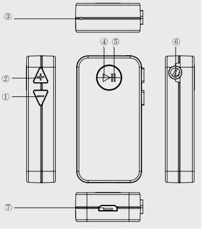

# Diagramma del prodotto.
1. Pulsante di Volume -
2. Pulsante di Volume +
3. Microfono
4. Pulsante di Multifunzione
5. Indicatore LED
6. 3,5mm Jack d’Uscita d’Audio
7. Micro USB Porta di Carica

# Per iniziare

Tenere premuto il pulsante multifunzione per 3 secondi per accendere/spegnere il dispositivo.

# Connessione bluetooth

Per collegare i Suoi dispositivi wireless al ricevitore, prima di tutto è necessario entrare in modalità
d’appaiamento per stabilire una connessione.
1. Iniziare con il ricevitore spento.
2. Tenere premuto il Pulsante di Multifunzione per 5 secondi e il ricevitore entra in modalità d’appaiamento
   
3. Accendere la funzione d’appaiamento del dispositivo che si vuole appaiare con il ricevitore.
4. Nell’elenco dei dispositivi disponibili, trovare e scegliere “Aukey BR-C2”.
5. Se è richiesto un codice o un pin per l’appaiamento, si prega d’inserire “0000”.

## Appaiare Contemporaneamente Due Dispositivi

1. Seguire le istruzioni nella sezione “Appaiamento” per appaiare il ricevitore con il Dispositivo A.
   
2. Quando è appaiato, disabilitare la funzione d’appaiamento sul Dispositivo A e spegnere il ricevitore.
   
3. Seguire le istruzioni nella sezione “Appaiamento” per appaiarlo con il Dispositivo B.
4. Quando è appaiato con il Dispositivo B, riattivare la funzione d’appaiamento sul Dispositivo A e il
 ricevitore lo ricollega automaticamente.
5. Adesso Lei può fare e ricevere le chiamate da entrambi i due dispositivi appaiati.

### Nota

- Il ricevitore si spegne automaticamente dopo 5 minuti in modalità d’appaiamento se nessun dispositivo
 viene appaiato
- Se il Suo dispositivo appaiato è spento o scollegato, il ricevitore si spegne automaticamente dopo 5 minuti
- Se Lei esce dalla gamma d’operazione, il ricevitore perde la connessione ed entra in modalità di standby.
 La connessione viene ristabilita una volta che Lei ritorna alla gamma wireless entro 5 minuti. Il ricevitore
 ricollega automaticamente l’ultimo dispositivo appaiato con successo. Per collegare gli altri dispositivi,
 si prega di ripetere la precedente sezione “Appaiamento”

 

# Controlli & Indicatori LED
## Telefonare

| | |
| --------------------------------------- | --------------------------------------------------------- |
| Per rispondere / terminare una chiamata | Premere una volta il Pulsante di Multifunzione            |
| Per rifiutare una chiamata in arrivo    | Tenere premuto il Pulsante di Multifunzione per 2 secondi |
| Per rifare l’ultimo numero              | Premere due volte il Pulsante di Multifunzione            |

# Trasmissione audio

Quando è appaiato, Lei può trasmettere l’audio senza fili dal Suo dispositivo. La musica sospende
automaticamente quando Lei riceve una chiamata in arrivo, e riprende una volta che la chiamata è finita.

| | |
|-|-|
| Pausa / Ripresa |Premere una volta il Pulsante di Multifunzione |
| Controllo di Volume | Premere a lungo il Pulsante di Volume + / - |
| Traccia Successiva / Precedente | Premere brevemente il Pulsante di Volume + / - |

 

| Indicatori LED | Stati |
|-|-|
| Lampeggia in blu e rosso alternativamente | Modalità d'appaiamento |
| Lampeggia in blu due volte ogni tre secondi | Collegato |
| Lampeggia in rosso | Batteria scarica |
| Rosso acceso | Caricando |
| Rosso spento | Caricato completamente |

 

## Reset
Spegnere il ricevitore, tenere premuto il Pulsante di Multifunzione per 8 secondi finché il ricevitore sia spento
di nuovo.

## Precauzione
Si prega d’allontanare dai liquidi e dal calore estremo
